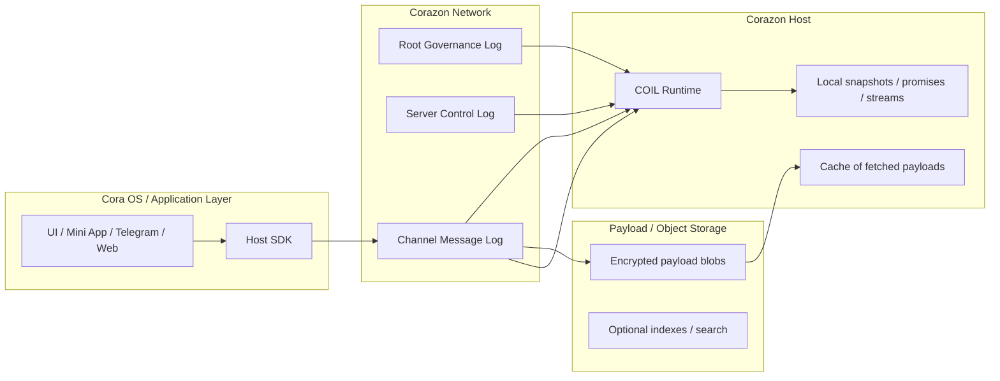
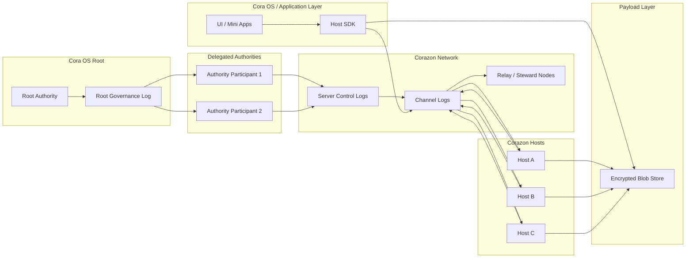

# Слои системы

Система не является одним «бэкендом» и не является одним «протоколом». Это набор слоёв, каждый из которых решает **одну задачу**, и каждый из которых можно описывать отдельно, не затягивая в описание всё остальное.

## Пять слоёв

**A. Identity / Authority.**
Слой легитимности. Отвечает на вопрос «кто имеет право делать что». Содержит корневой authority, делегированные authority и append-only журнал governance-событий. Не передаёт сообщений, не хранит payload, не исполняет код.

**B. Server Control Plane.**
Слой администрирования конкретного сервера: создание сервера, создание каналов, добавление и удаление участников, изменение политик. Это отдельный append-only журнал, легитимность которого проверяется по слою A.

**C. Header Log.**
Слой сообщений как фактов. Для каждого сообщения в системе существует подписанное header-событие, которое реплицируется по сети. Заголовок несёт маршрутизацию, идентификаторы, связи (reply, mention), ссылку на payload и его хеш. Содержимого сообщения в этом слое нет.

**D. Payload Store.**
Слой содержимого. Зашифрованный blob, на который ссылается заголовок. Хранится отдельно, реплицируется по другим правилам, может кешироваться локально. Отделение D от C — ключевое структурное решение: оно позволяет распространять факт «сообщение существует и адресовано тебе» без раскрытия его содержимого.

**E. Corazon Host / Execution.**
Слой исполнения. Локальное окружение, которое слушает релевантные header-логи, забирает нужные payload, расшифровывает их и спавнит инстансы протоколов (COIL) в ответ на события. Хост — это единственное место, где происходит реальное вычисление и где plaintext сообщений становится видимым.

## Почему именно пять

Граница между слоями — это не архитектурная декорация, а граница ответственности. Каждый слой имеет свой жизненный цикл, свою модель доверия и свои режимы отказа:

- **A** может быть недоступен — но уже подписанные ранее grants остаются проверяемыми.
- **B** может отставать — но slow consistency допустима, потому что governance не меняется каждые секунды.
- **C** может быть частично реплицирован — узел видит только те каналы, на которые подписан, и этого достаточно.
- **D** может быть недоступен для части узлов — ссылка на payload остаётся валидной, а контент можно получить позже.
- **E** может быть выключен или перезапущен — состояние восстанавливается из C и D.

Никто из слоёв не обязан знать внутреннюю механику другого. Между ними — явные контракты: подписи, хеши, идентификаторы.

## Что от этого выигрывает система

Три главных следствия такого расслоения:

1. **Приватность отделена от маршрутизации.** Сам факт сообщения распространяется, содержимое — нет. Это делает возможной p2p-репликацию без утечки plaintext.
2. **Governance отделён от транспорта.** Можно отзывать права, не останавливая сеть. Можно реплицировать сообщения, не имея права их подписывать. Легитимность и доставка — независимые способности.
3. **Исполнение отделено от долгой памяти.** Хост не «хранит» историю — он читает её. Это снимает огромный класс проблем с синхронизацией состояния между инстансами.

## Что от этого теряется

Сложность навигации для нового человека. Чтобы понять, как доходит одно сообщение, нужно одновременно держать в голове три разных лога (governance, control, channel) и два разных хранилища (header network и payload store). Без карты слоёв система выглядит как набор независимых компонентов без ясной причины, почему их именно столько.

Именно поэтому имеет смысл иметь карту слоёв рядом с самой системой — чтобы новый читатель мог посмотреть на каждый слой отдельно, не перегружаясь остальным.

## Проекция: где живут разные классы данных

Структурная проекция, которая показывает, **где** хранятся разные классы данных, не описывая, что происходит первым. Это карта границ ответственности, а не последовательность действий. Главное здесь — увидеть, что header network, payload storage и локальный хост Corazon — это **три разных хранилища с тремя разными правилами доступа**, и одно приложение касается всех трёх через явные интерфейсы.

## Проекция: вся система одной картой

Сводный, высокоуровневый вид системы. Его задача — поместить три большие части (root governance, Corazon Network, локальные среды исполнения) в одну согласованную картинку. Это не диаграмма для протокола, это **карта для ориентации**: куда смотреть, если хочется увидеть, как layer'ы соединяются друг с другом.

