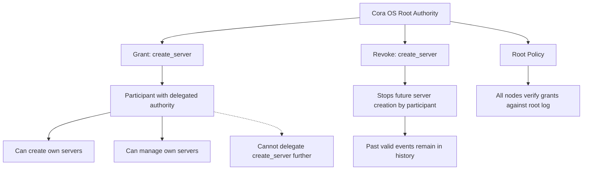
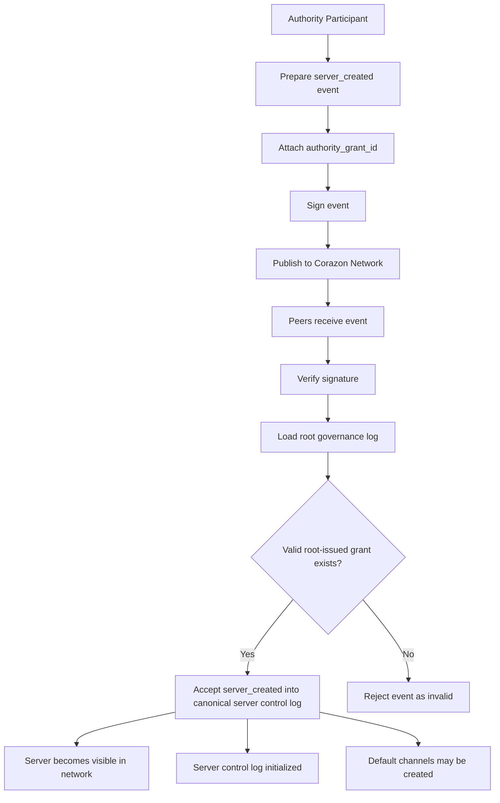
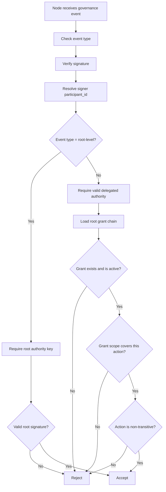

# Governance и authority

Governance в этой системе — это не «кто в админке кликает кнопки». Это ответ на вопрос «чему узлы сети обязаны верить как легитимному». Ответ должен быть одинаковым у всех независимых участников, иначе сеть расползается на несовместимые ветки.

## Root Authority

В корне всегда стоит **Root Authority** — источник легитимности, который не выводится ни из чего другого. Его подписи подтверждаются встроенным корневым ключом. Технически это может быть один ключ, набор ключей или мультиподпись — форма не критична. Критично другое: **любая цепочка легитимности в системе заканчивается на root**.

Root подписывает governance-события: grant (выдать право) и revoke (отозвать право). Эти события идут в отдельный append-only журнал — Governance Log.

## Delegated Authority

Root не создаёт серверы сам. Root **выдаёт право** участнику создавать свои серверы. Получивший grant участник называется **Delegated Authority** и может:

- создавать новые серверы,
- управлять уже созданными серверами,
- издавать server control события в рамках своих серверов.

Это и есть слой, на котором обычный пользователь становится «админом своего пространства».

## Одношаговая нетранзитивная делегация

Ключевое решение: **делегация не транзитивна**. Delegated Authority не может передать своё право создавать серверы третьему участнику. Глубина цепочки всегда одна: root → участник. Дальше — нельзя.

Почему:

- Транзитивная делегация требует, чтобы каждый узел сети мог проверить цепочку произвольной длины. Это дорого, хрупко и открывает атаки через отзыв промежуточных звеньев.
- Одношаговая делегация оставляет проверку легитимности простой: узел смотрит root log, находит прямой grant, проверяет подпись — и всё.
- Не возникает вопрос «а что делать, если промежуточное звено отозвано, но созданные им серверы продолжают жить».

Это сознательное ограничение выразительности в пользу простоты модели доверия. Делегационные модели можно будет усложнить позже, если появится реальная потребность, — но обратная миграция (от сложной к простой) гораздо болезненнее, поэтому в первой версии правильный выбор — самая простая модель.

## Принцип: root управляет будущей легитимностью, а не прошлыми фактами

Это важное свойство append-only системы. Когда root revokes grant у участника, это означает: **будущие** server_created события, подписанные этим участником, не будут приниматься сетью. Но уже созданные серверы, уже выпущенные сообщения, уже реплицированные логи **остаются в истории**. Их нельзя стереть.

Это не баг. Это фундаментальное свойство архитектуры:

- Прошлое — это факт. Оно не переписывается.
- Настоящее — это набор действующих разрешений. Оно может меняться.
- Легитимность события проверяется относительно состояния governance **на момент события**, а не относительно сегодняшнего состояния.

Если governance разрешил участнику создать сервер вчера, этот сервер создан легитимно — даже если сегодня участник лишился всех прав. Серверу придётся жить без дальнейших действий этого участника, но его существование в прошлом остаётся фактом.

## Почему это именно governance-слой, а не просто «права в БД»

В централизованной системе права живут в базе данных и меняются одним админом. В распределённой системе такой базы нет — каждый узел должен уметь сам проверить, легитимно ли событие. Для этого нужны:

- детерминированный способ получить «текущее» состояние прав (journal governance),
- детерминированный способ проверять события относительно этого состояния,
- договорённость о том, что считать канонической веткой, если появятся расхождения.

Governance Log — это именно такой механизм. Он маленький (grants/revokes случаются редко), он append-only, он независимо проверяется каждым узлом.

## Что остаётся открытым

- Точная форма governance-событий (какие поля обязательны, как они сериализуются).
- Процедура замены root-ключа, если это вообще допустимо.
- Что делать при конфликте двух веток governance log (вероятно, требуется временный sequencer или явное правило разрешения).

Эти вопросы собраны в `open-questions.md`.

## Проекция: модель root authority

Эта проекция показывает governance как **рутованную структуру полномочий**, не касаясь транспорта и исполнения. Root издаёт policy, выдаёт grants, отзывает grants. Получатель grant'а может создавать и управлять собственными серверами, но не может передавать grant дальше. Revoke прекращает будущую активность, но прошлые валидные события остаются в истории.

## Проекция: жизненный цикл server_created

Эта проекция объясняет, что **создание сервера легитимизируется не самим фактом публикации**, а проверяемой цепочкой authority в governance log. Authority participant готовит событие, прикрепляет authority_grant_id, подписывает, публикует. Сеть проверяет подпись и валидность гранта против root governance log — и только потом принимает событие в канонический server control log.

## Проекция: проверка легитимности governance-события

Эта проекция формализует **проверку легитимности как отдельный процесс**, не зависящий ни от репликации, ни от исполнения. Узел не доверяет подписи как таковой; он проверяет тип события, подпись, источник, существование грантa, его область действия и нетранзитивность. Только всё это вместе делает событие принятым.

