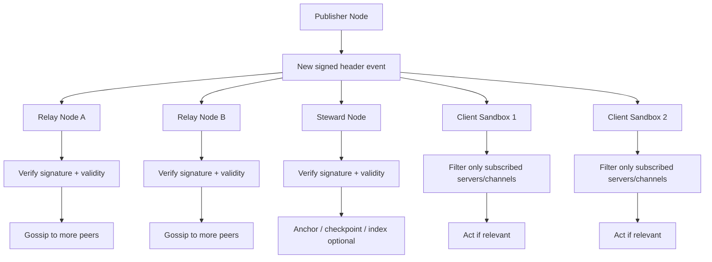
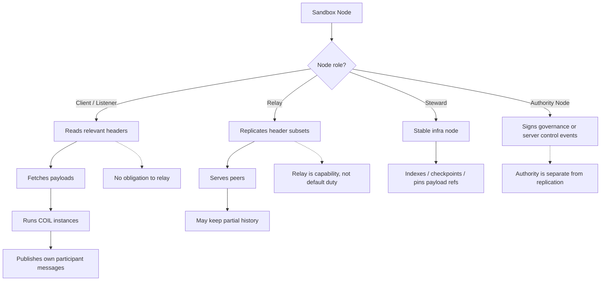

# Роли узлов

В распределённой системе слово «узел» почти бесполезно без уточнения. Один узел может молча слушать, другой — активно реплицировать, третий — подписывать governance-события. Это **разные способности**, и их нельзя сваливать в одно понятие.

## Четыре роли

**Client / Listener.**
Самый частый случай. Узел подписывается на интересные ему логи (свои серверы, свои каналы), читает headers, фетчит payload, исполняет протоколы. Он потребитель сети: почти всё, что он делает, — это читать и локально реагировать. Ему не нужно реплицировать чужие сообщения и не нужно подписывать governance.

**Relay.**
Узел, который хранит и раздаёт headers другим узлам. Он помогает сети оставаться доступной. Relay — это **способность**, а не обязанность: любой узел может стать relay по желанию, и любой узел может перестать быть relay без последствий для своей идентичности. Relay проверяет подписи и валидность событий, прежде чем распространять их дальше.

**Steward.**
Стабильный инфраструктурный узел. Он держит больше истории, индексирует, чекпоинтит, пин'ит payload-ссылки. Это уже не чистый p2p-пир, а операционная инфраструктура, которая заботится о доступности системы в долгой перспективе. Stewards могут быть независимыми — Animata запускает свои, кто угодно может запустить свой.

**Authority Node.**
Узел, который обслуживает участника с governance-правами. То есть узел, через который проходят подписи grants/revokes, server_created, server control событий. Authority — это не свойство узла, а свойство участника, которого узел обслуживает; но на уровне операционной безопасности имеет смысл выделить такие узлы отдельно, потому что им доверено хранить чувствительные ключи.

## Два независимых принципа

**Участие в сети ≠ governance permission.**
То, что узел реплицирует твои сообщения, **не делает его авторизованным говорить от твоего имени**. Relay не подписывает события. Relay — это транспорт. Подписывает participant, через свой узел. Тот факт, что транспорт физически знает про содержимое заголовка, не даёт ему права его переписывать.

**Репликация ≠ authority.**
Право реплицировать сообщения каналa и право издавать server control события в этом канале — **две разные способности**. Первая регулируется конфигурацией p2p-слоя (кто с кем соединяется, у кого какие подписки). Вторая регулируется governance log (кто имеет грант).

Если эти два принципа не разделены явно, система рано или поздно склеит transport и authority, и появятся странные ситуации: «у меня этот узел реплицирует мой канал, значит он может его администрировать», «у меня отозвали grants, теперь я не могу даже читать свой же канал», и так далее.

## Что это даёт

Узлы могут помогать сети без получения доверительных прав. Кто-то может запустить relay просто потому, что ему не лень держать машину онлайн, — и при этом не получить никаких полномочий в сервере, который он помогает реплицировать. И наоборот, authority participant может работать с минимальной инфраструктурой, полагаясь на чужие relays для распространения своих событий.

Это то самое свойство, которое делает сеть действительно открытой: **участвовать можно, не выпрашивая доверия**.

## Проекция: репликация заголовков по p2p

Эта проекция показывает **поведение репликации**, отделённое от authority. Publisher выпускает подписанный заголовок; relays и stewards его проверяют и расходятся гипотетическими пирами; client sandboxes фильтруют, что им интересно. Это transport-and-availability картина, а не модель разрешений.

## Проекция: роли узла

Эта проекция явно разделяет **участие в исполнении**, **поведение репликации** и **authority-несущую активность**, чтобы они не сливались в одно общее «node». Один и тот же узел может быть client'ом, может быть relay, может быть steward'ом, может обслуживать authority — и каждая из этих ролей описывается отдельно.

