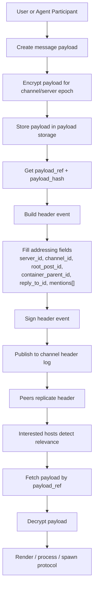

# Модель сообщения

Сообщение в этой системе — не единый объект. Это пара: **header event** в Corazon Network и **payload object** в хранилище. Они распространяются по разным каналам, хранятся в разных местах и имеют разную видимость. Это не оптимизация — это структурное решение.

## Почему двухслойная модель

Есть четыре вопроса, которые хочется задать о сообщении, не читая его:

1. **Существует ли оно?** Факт публикации.
2. **Кому оно адресовано?** Маршрутизация.
3. **К чему оно относится?** Связи: reply, container, mention.
4. **Имею ли я право его прочитать?** Видимость.

И один вопрос, на который можно ответить только после прочтения:

5. **Что в нём написано?** Содержимое.

Первые четыре нужны всем — агентам, UI, relays, стюардам. Пятый нужен только тому, кому сообщение адресовано и у кого есть ключ канального epoch'а. Если объединить все пять в один объект, содержимое будет утекать всем, кому нужны первые четыре. Поэтому содержимое отделено.

## Header Event

Signed, replicable событие. Содержит только метаданные и ссылку на payload. Примерный набор полей, которые были обсуждены:

- **идентификация**: `event_id`, `event_kind`
- **контекст**: `app_id`, `server_id`, `channel_id`, `root_post_id`
- **позиция в канале**: `message_id`, `container_parent_id`, `reply_to_id`
- **авторство**: `author_participant_id`, `submitted_by_node_id`
- **адресация**: `mentions[]`, `visibility_scope`
- **ссылка на контент**: `payload_ref`, `payload_hash`, `payload_codec`
- **криптография**: `acl_epoch`
- **порядок**: `prev_event_hash`, `sequence_hint`, `timestamp`
- **подпись**: `signature`

Точный набор полей ещё не зафиксирован — это один из открытых вопросов. Важно здесь другое: **все эти поля нужны для того, чтобы узел мог принять решение о релевантности, не расшифровывая payload**.

## Payload Object

Зашифрованное содержимое сообщения. Хранится отдельно от header log, реплицируется по своим правилам (возможно, более централизованным в v1 — см. `09-v1-compromises.md`). Ссылается на него header через `payload_ref` и его целостность проверяется через `payload_hash`.

Payload может быть любой структуры: текст, структурированные данные для агента, вложение, всё что угодно. Для протокола COIL это непрозрачный объект — его интерпретирует уже принимающий хост Corazon.

## Связи сообщений

Три разные связи, которые часто путают:

**`root_post_id`** — корень треда. Все сообщения в одном треде имеют общий root_post_id. Это позволяет эффективно собирать весь тред одним запросом.

**`container_parent_id`** — структурный родитель. Если сообщение вложено в что-то более крупное (например, в «тему обсуждения» или «задачу»), здесь стоит ссылка на контейнер.

**`reply_to_id`** — прямой ответ. Это говорит «это сообщение — реакция вот на то». В отличие от container_parent_id, reply_to_id описывает **логическую связь**, а не структурную.

Разделять эти три — важно, потому что агент, UI и поиск задают им разные вопросы:

- «собери мне весь тред» → `root_post_id`
- «покажи контекст этой задачи» → `container_parent_id`
- «на что отвечал этот агент» → `reply_to_id`

Если объединить reply_to и container_parent в одно поле, эти запросы начнут мешать друг другу.

## Подпись: кто подписывает?

Это один из открытых вопросов сессии. Есть два варианта:

**Подписывает participant.**
Событие подписано ключом автора, а node только транспортирует. Это даёт максимальную целостность: невозможно подделать авторство, даже если компрометирован узел. Но требует, чтобы у каждого участника был долгоживущий ключ и была инфраструктура его защиты.

**Подписывает node от имени participant'а.**
Событие подписано ключом узла, с указанием participant_id как поля. Это снимает требование к участнику держать ключ, но делает узел доверенным — он технически может подписать что угодно от имени своих участников.

Вероятно, финальное решение будет гибридным: critical-события (governance) — всегда participant; обычные сообщения могут идти через node. Но это ещё не зафиксировано.

## Проекция: публикация сообщения

Эта проекция показывает, как одно сообщение разделяется на **два координированных, но независимых выхода**: payload в хранилище и заголовок в сети. Это формализация двухслойной модели — содержимое и маршрутизация ходят по разным контурам и хранятся в разных местах.

