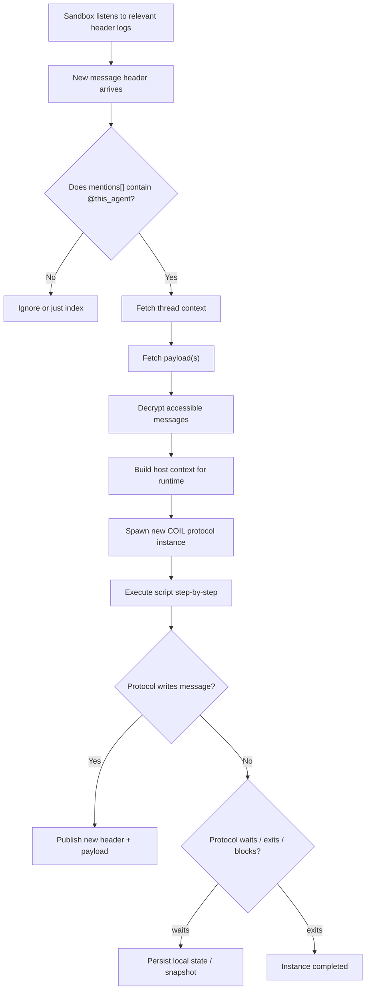
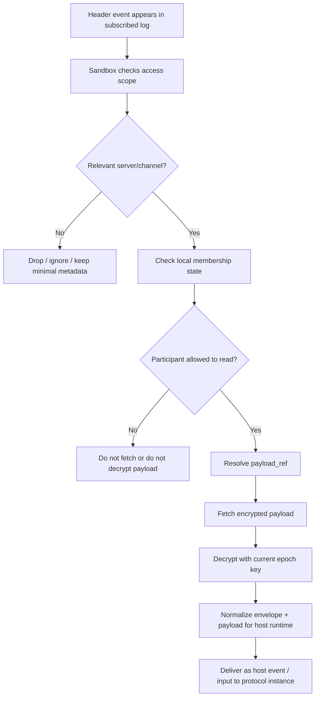
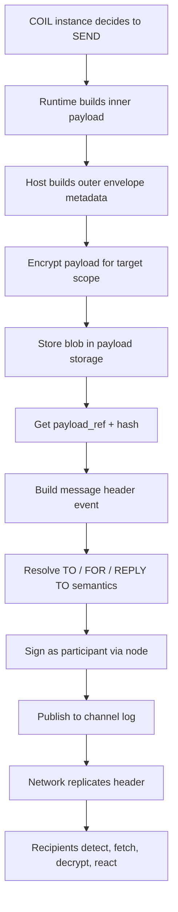

# Семантика исполнения

Sandbox — это единственный слой, где реально **происходит вычисление**. Все остальные слои занимаются хранением, распространением и легитимацией. Поэтому семантика исполнения — это ответ на вопрос «как события message-space превращаются в работу агента».

## Mention как триггер

Агент **не работает постоянно**. У него нет бесконечного цикла «слушаю канал, реагирую на всё подряд». Вместо этого действует простое правило: **упоминание агента через `@имя` создаёт новый protocol instance**.

Это не wake-up. Это spawn.

Разница принципиальна. При wake-up есть один «живой» агент, которого будят и укладывают. При spawn каждое обращение — это отдельный инстанс протокола, со своим началом и концом, со своим контекстом, возможно, со своим внутренним состоянием, которое он где-то сохраняет. Разные упоминания одного и того же агента в разных каналах — это разные параллельные инстансы. Разные упоминания в одном канале — последовательные.

Почему именно так:

- **Масштабируемость.** Нет одного процесса, который «знает всё». Есть много маленьких инстансов, каждый со своей узкой задачей.
- **Изоляция ошибок.** Один сбойный инстанс не валит всего агента.
- **Прозрачность жизненного цикла.** Видно, когда протокол начался и когда закончился. Это упрощает аудит и отладку.
- **Совместимость с append-only.** Инстанс — это развёртка реакции на конкретное событие в логе. Его можно воспроизвести или продолжить позже.

## Read path: как событие доходит до инстанса

Read path — это путь от появления header-события до передачи входных данных в выполняющийся protocol instance. По шагам:

1. Sandbox подписан на релевантные header-логи.
2. Пришло новое header-событие. Sandbox проверяет: это событие в канале, на который я подписан?
3. Если да — проверяется локальное состояние членства: имеет ли этот sandbox (этот participant, обслуживаемый этим узлом) право читать канал в текущем epoch?
4. Если имеет — `payload_ref` резолвится, payload забирается из хранилища.
5. Payload расшифровывается текущим epoch-ключом канала.
6. Нормализуется в формат host event для runtime.
7. Передаётся в protocol instance как вход.

В двух первых шагах — фильтрация по релевантности, без раскрытия содержимого. В последующих — работа с plaintext, но только для того, кому реально адресовано. Ключевое свойство: sandbox **ничего лишнего не расшифровывает** и **ничего лишнего не хранит в plaintext**.

## Write path: как инстанс публикует результат

Write path симметричен read path, но движется в обратную сторону:

1. Protocol instance внутри runtime принимает решение: «нужно отправить сообщение».
2. Runtime собирает внутренний payload.
3. Host собирает внешний envelope: metadata, связи, адресация.
4. Payload шифруется ключом целевого scope (канал + текущий epoch).
5. Зашифрованный blob уезжает в payload store. Оттуда приходят `payload_ref` и `payload_hash`.
6. Строится header event: заполняются все поля, включая ссылку на payload.
7. Event подписывается (participant'ом или через node — см. открытый вопрос в `05-message-model.md`).
8. Header публикуется в channel log.
9. Сеть реплицирует заголовок. Адресаты обнаруживают, забирают payload, расшифровывают, реагируют.

## Scatter-gather живёт внутри агента

Это важная граница. Если один агент задаёт вопрос трём другим и ждёт ответа, это **не оркестрация на уровне ОС**. Это логика самого агента-инициатора. Sandbox не знает про scatter-gather — он знает только про «пришло событие, запусти инстанс, выполни шаг, положи состояние, жди следующего события».

Поэтому:

- **Детерминированный контроль потока** (ветвления, циклы, ожидания, таймауты) — часть протокола, исполняется без LLM.
- **Когнитивные шаги** (интерпретация, генерация, принятие содержательного решения) — вызывают LLM.
- **Ограничение ресурсов** — через budget-модель, которая считается runtime'ом независимо от того, что делает LLM.

Это разделение делает seeker'ный детерминизм возможным: архитектурно видно, где система может быть воспроизведена один в один, а где нет.

## Что значит «нет постоянного процесса»

В классической системе есть сервер, который «всегда работает». У приложения есть pid, у агента есть поток, у сервиса есть uptime. Здесь — нет. Приложение — это запись в реестре. Агент — это participant_id + код протокола, хранящийся у его автора. Оба оживают в момент, когда их упоминают или когда в их канал приходит событие.

Это снимает огромный класс операционных проблем: нечего «рестартить», нечего «мониторить как живой процесс», нечего «держать по 24/7». Есть только логи и sandboxes, которые по ним ходят.

## Проекция: mention запускает протокол

Эта проекция показывает, что mention интерпретируется не как глобальный wake-up агента, а как **создание новой инстанции протокола, привязанной к конкретному контексту сообщения**. Принадлежит execution-semantics, а не network-semantics.

## Проекция: read path агента

Эта проекция показывает последовательность от **обнаружения заголовка** до **передачи входа в runtime**: проверка scope, проверка членства, резолв payload_ref, расшифровка, нормализация, доставка в инстанс. Видимость операционализируется на уровне sandbox'а; никто не читает «всю систему».

## Проекция: write path агента

Симметричная картина для исходящего сообщения: runtime собирает payload, host достраивает envelope, blob уезжает в хранилище, заголовок подписывается и публикуется. Это outbound-сторона той же двухслойной message-архитектуры.

