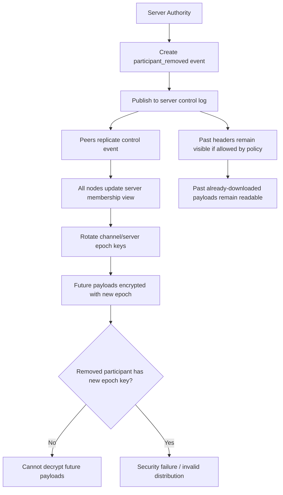

# Отзыв доступа и epoch-ключи

Как убрать человека из канала, если канал — это append-only лог в распределённой сети? Ответ — через **epoch-ключи**, и этот ответ имеет цену, которую нужно честно назвать.

## Что именно отзывается

Когда участник удаляется из сервера (или из канала), сеть не стирает прошлое. Она делает три вещи:

1. Публикует `participant_removed` в server control log. Это обычное подписанное событие, его реплицируют все.
2. Все узлы обновляют своё представление о членстве сервера.
3. **Ротируется epoch-ключ** канала (или сервера, в зависимости от scope). Все будущие payload'ы шифруются новым ключом, и новый ключ **не выдаётся** удалённому участнику.

Результат: удалённый участник не может расшифровать **будущие** сообщения. Это и есть «отзыв доступа».

## Что остаётся читаемым

**Старые payload'ы, которые уже были расшифрованы.** Если участник успел прочитать сообщение до своего удаления — это сообщение у него на диске, в plaintext, и его нельзя «выкрасть обратно».

**Старые header-события.** Они подписаны и реплицированы. Метаданные — факт существования сообщения, его контекст, `mentions[]`, ссылка на payload — остаются видимыми тем, у кого есть доступ к соответствующему каналу в том старом epoch'е.

**Старые зашифрованные payload'ы, к которым у удалённого есть старый ключ.** Технически, если он скачал blob заранее и имел старый epoch-key, он может прочитать их и сегодня.

Это не недостаток — это свойство append-only архитектуры. Системы, которые обещают «стереть сообщение отовсюду» в p2p-сети, обещают невозможное.

## Channel-level vs server-level epochs

Принципиальный выбор: на каком уровне крутятся epoch-ключи.

**Server-level.** Один ключ на весь сервер. При любом revoke приходится крутить всё. Операция дорогая, затрагивает всех участников сервера, все каналы перешифровываются, всем членам нужно получить новый ключ. Зато модель простая: один scope — один секрет.

**Channel-level.** Свой ключ у каждого канала, крутится независимо. Удаление участника из одного канала не ломает его доступ к другим каналам того же сервера. Удаление участника из сервера — это каскад revoke по всем каналам, но каждый канал крутит свой ключ отдельно.

Channel-level предпочтителен. Причины:

- **Гранулярность.** Участники часто имеют разный набор прав в разных каналах. Server-level это игнорирует.
- **Локализация влияния.** Revoke в одном канале не затрагивает весь сервер.
- **Совпадение с ментальной моделью.** Пользователи мыслят в терминах каналов, а не в терминах «всего сервера как одного секрета».

Цена: немного больше криптографической бухгалтерии и отдельный жизненный цикл ключей в каждом канале. В v1 это приемлемо.

## Принцип асимметрии прошлого и будущего

Это общее правило, которое стоит проговорить вслух:

> Root (и любой уровень authority ниже него) управляет **будущей легитимностью**, а не **прошлыми фактами**.

В терминах revoke это значит:

- **Можно** запретить участнику публиковать в будущем.
- **Можно** запретить ему расшифровывать новые сообщения.
- **Нельзя** стереть его прошлые сообщения.
- **Нельзя** вернуть обратно сообщения, которые он уже прочитал.

Это не «ограничение v1». Это **природа системы**. Любая распределённая append-only архитектура имеет это свойство, и попытки его обойти (например, обязательное шифрование с принудительным уничтожением ключа) только добавляют ложных гарантий.

Лучше честно сказать пользователю: «мы можем закрыть ему будущий доступ, но мы не можем заставить его забыть то, что он уже видел».

## Soft delete сообщений

Аналогичная логика применяется к удалению отдельных сообщений. Автор может опубликовать `message_deleted` — ещё одно header-событие, которое говорит «считайте предыдущее сообщение удалённым». Хосты Corazon и UI **уважают** этот флаг и не показывают контент. Но сам header и сам payload при этом остаются в логе и в хранилище, потому что их оттуда не достать.

Это называется soft delete. Для v1 — достаточно. Hard delete (физическое стирание) — возможно только при согласии всех реплик хранилища, а этого в распределённой сети гарантировать нельзя.

## Проекция: удаление участника и ротация ключей

Эта проекция показывает **компромисс append-only revoke**: будущее закрывается, прошлое — нет. Authority публикует `participant_removed`, узлы обновляют членство, ротируется epoch-ключ канала, новый ключ не достаётся удалённому участнику. Уже скачанные payload'ы и уже видимые заголовки остаются такими, как есть.

