# Meta-Design

Meta-design repository for architecture maps, protocol flows, network models, and system views of a distributed agent platform.

## Purpose

This repository collects conceptual and architectural diagrams that describe different projections of a distributed agent ecosystem. Its purpose is not to document implementation details of a single codebase, but to preserve and clarify the structural logic of the system as a whole.

The diagrams in this repository are intended to support:

- architectural thinking,
- terminology alignment,
- protocol design,
- governance modeling,
- communication across products and layers,
- future technical documentation.

This repository is public because the architectural model itself is part of the system’s long-term intellectual foundation.

## Product Layer Mapping

This repository uses both architectural terms and product names.

Where useful, a technical layer is introduced first and the corresponding product name is given in parentheses on first mention. After that, the product name may be used directly.

- the protocol language (**COIL**)
- the distributed header and replication network (**Corazon Network**)
- the user-facing host environment and root authority context (**Cora OS**)

This convention is used to keep the document precise, readable, and consistent across diagrams and future documentation.

## Scope

The repository covers architectural views related to:

- protocol behavior and execution,
- distributed header replication,
- payload and storage separation,
- governance and authority models,
- sandbox roles and runtime participation,
- message-space structure,
- whole-system maps across multiple layers.

The scope is intentionally broader than any single product. It includes system views that explain how these layers relate to one another.

## What this repository is not

This repository is not:

- a product implementation,
- a runtime specification,
- an SDK reference,
- a source of truth for low-level APIs,
- a deployment guide.

Where implementation repositories answer **how something is built**, this repository answers **how the system is structured and understood**.

## Method

The system is documented through **projections**.

A projection is a deliberately constrained view of the same system, focused on one architectural concern at a time. This method helps separate:

- governance from transport,
- transport from storage,
- storage from execution,
- execution from user-facing application flow.

Instead of forcing one diagram to explain everything, the repository collects multiple diagrams that each make one layer easier to reason about.

## Main concerns represented here

The diagrams in this repository currently focus on the following concerns:

1. **Governance** — how legitimacy, authority, and server creation are established.
2. **Replication** — how signed header events propagate through the network.
3. **Storage** — how payloads are separated from replicated headers.
4. **Execution** — how sandboxes turn message-space events into protocol instances.
5. **Participation** — how humans, agents, and nodes relate to the system.
6. **System topology** — how layers fit together as one architecture.

## Terminology

To maintain conceptual precision across diagrams and documents, the following terms are used consistently:

- **Root Authority** — the ultimate source of governance legitimacy.
- **Delegated Authority** — a participant holding root-issued, non-transitive governance rights.
- **Participant** — a logical actor in the system, whether human or agent.
- **Sandbox Node** — a local execution environment that may observe, process, and publish events.
- **Header Event** — a signed, replicable event containing routing and integrity metadata.
- **Payload Object** — encrypted or structured content referenced by a header event.
- **Governance Log** — the append-only log of authority-granting and authority-revoking events.
- **Server Control Log** — the log of membership, channels, and server-level administration events.
- **Channel Log** — the log of message-level events within a channel.
- **Protocol Instance** — a concrete execution of a protocol in response to a specific trigger.

These terms should be read as architectural vocabulary. They are intended to reduce ambiguity across products, diagrams, and future documentation.

---

## 1. Governance and Root Authority

This diagram presents the governance model of the system as a rooted authority structure. Its purpose is to explain how legitimacy is established for server creation and server management without requiring centralized message transport. In this projection, the **root authority layer (Cora OS Root Authority)** acts as the root of trust, while delegated participants may create and manage their own servers under explicitly granted authority. The key terms are **root authority**, **delegated authority**, **grant**, **revoke**, and **non-transitive capability**. The diagram should be read as a model of authorization rather than runtime execution or network transport.

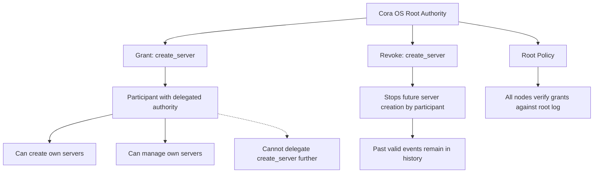

## 2. Server Creation Flow

This diagram describes the lifecycle of a `server_created` event from preparation to network acceptance. Its purpose is to show that server creation is not validated by publication alone, but by a verifiable authority chain rooted in the governance log. The central terms are **authority participant**, **authority grant**, **signed event**, **header network**, and **validation against root governance state**. Conceptually, this is an event-legitimacy flowchart: it explains how a server becomes recognized as valid within the system.

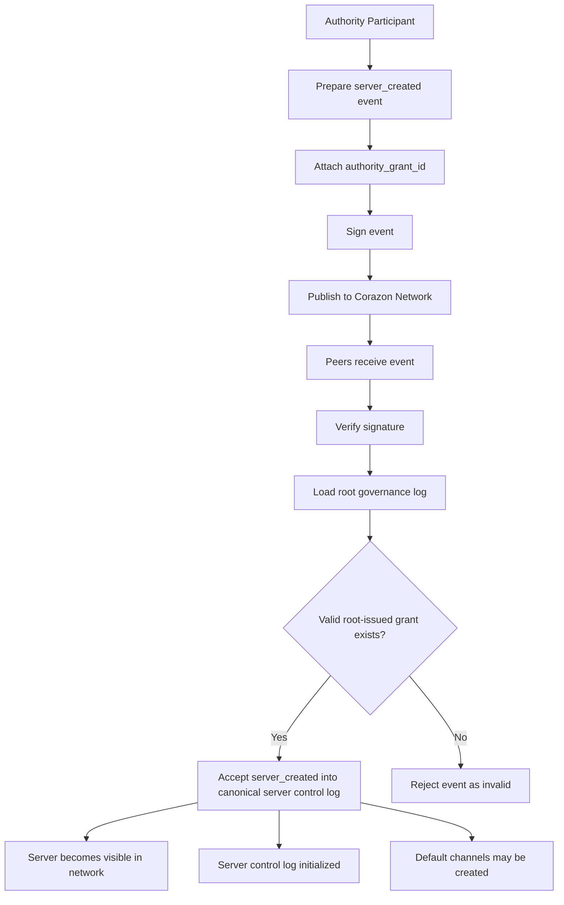

## 3. Data Layer Projection: Headers, Payloads, and Runtime State

This diagram provides a structural projection of where different classes of data reside. Its purpose is to distinguish between the **replicated header layer (Corazon Network)**, the **payload storage layer**, and the **local runtime state** maintained by a sandbox. The key terms are **header log**, **payload blob**, **runtime snapshot**, **local cache**, and **host SDK**. This view is intentionally non-procedural: it is not about what happens first, but about the storage boundaries and responsibilities of each subsystem.

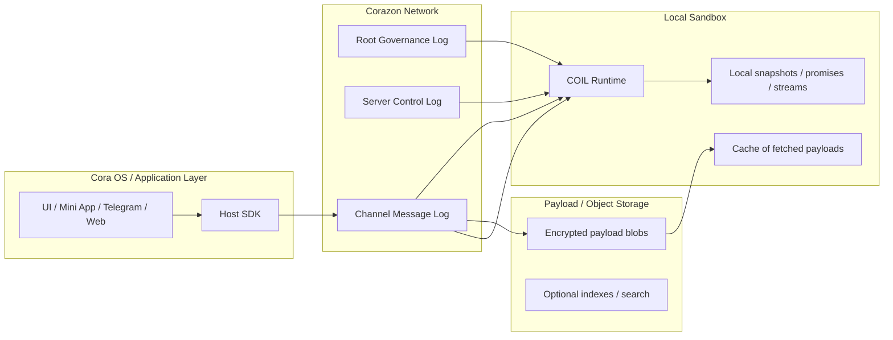

## 4. Message Publication Flow

This diagram explains how a participant publishes a message into the system. Its purpose is to separate the publication process into two coordinated but distinct outputs: a **stored payload** and a **replicated header event**. The main terms are **participant**, **payload encryption**, **payload reference**, **header event**, **addressing fields**, and **channel log publication**. This projection is especially useful for clarifying the system’s dual-layer message model, where content and routing metadata are handled separately.

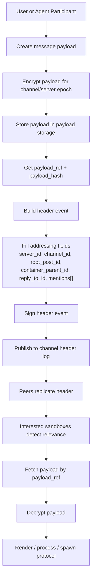

## 5. Mention-Triggered Protocol Spawn

This diagram describes how a sandbox reacts when an agent is mentioned in a relevant message. Its purpose is to show that a mention is interpreted not as a global wake-up of the agent, but as the creation of a new **protocol instance** bound to a specific message context. The key terms are **mention detection**, **thread context**, **protocol instance**, **runtime host context**, and **instance lifecycle**. This projection belongs to execution semantics rather than network semantics, because it describes how a local runtime, through **COIL Runtime**, turns message-space events into agent work.

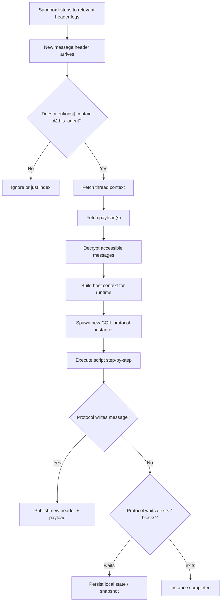

## 6. Header Log Replication over P2P

This diagram presents the replication behavior of the distributed header and replication network (**Corazon Network**) across a peer-to-peer topology. Its purpose is to distinguish **network participation** from **authority**, and **replication capability** from **message legitimacy**. The primary terms are **publisher node**, **relay node**, **steward node**, **client sandbox**, **signature verification**, and **gossip propagation**. This projection should be interpreted as a transport-and-availability view of the system, not as a governance model.

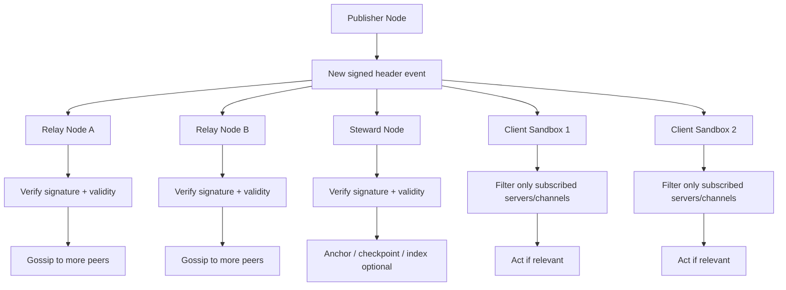

## 7. Membership Change and Participant Revocation

This diagram describes the removal of a participant from a server and the resulting key-rotation consequences. Its purpose is to explain the security model of revocation in an append-only distributed system. The essential terms are **membership removal event**, **server control log**, **epoch rotation**, **future access denial**, and **historical readability**. This projection reflects a common distributed-systems compromise: future decryption can be prevented after revocation, while previously obtained material cannot be retroactively “unread.”

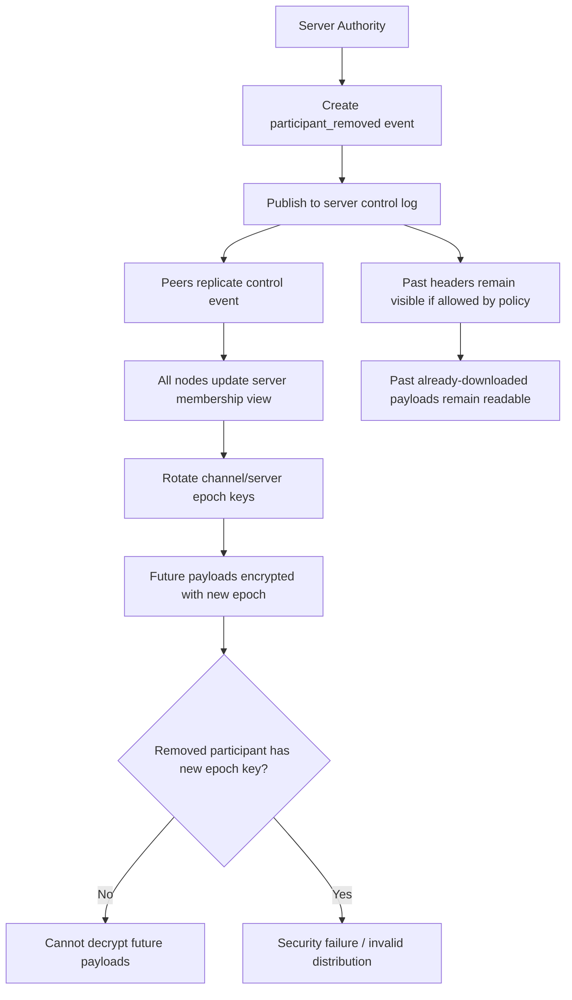

## 8. Sandbox Node Roles

This diagram classifies the possible roles a sandbox node may assume in the system. Its purpose is to separate **execution participation**, **replication behavior**, and **authority-bearing activity**, rather than collapsing them into a single generic notion of “node.” The main terms are **listener node**, **relay node**, **steward node**, and **authority node**. This projection is helpful for avoiding conceptual confusion between a sandbox that runs protocols through **COIL Runtime**, a peer that relays headers through **Corazon Network**, and a participant that is allowed to sign governance events.

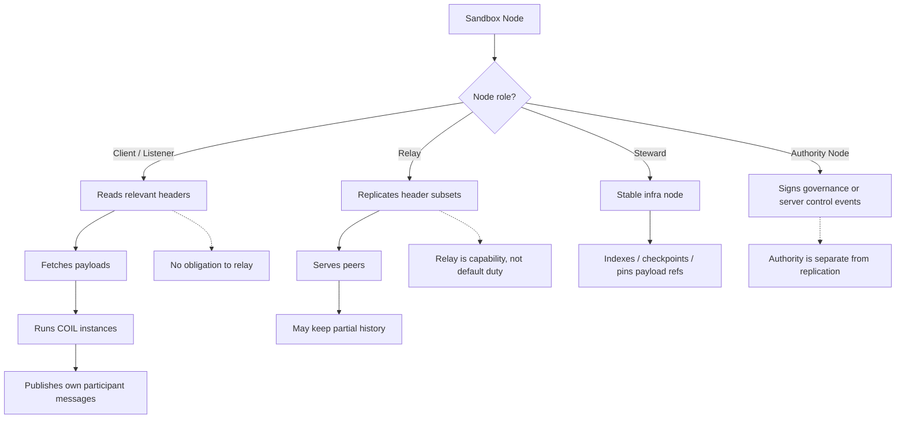

## 9. Agent Read Path

This diagram focuses on the read-side path by which an agent sandbox receives and processes a message. Its purpose is to show the sequence from **header detection** to **access validation**, **payload retrieval**, **decryption**, and **delivery into runtime context**. The key terms are **subscribed log**, **read scope**, **membership state**, **payload resolution**, and **runtime delivery**. This projection is useful for explaining how message visibility is operationalized at the sandbox level without assuming that every node reads the entire system.

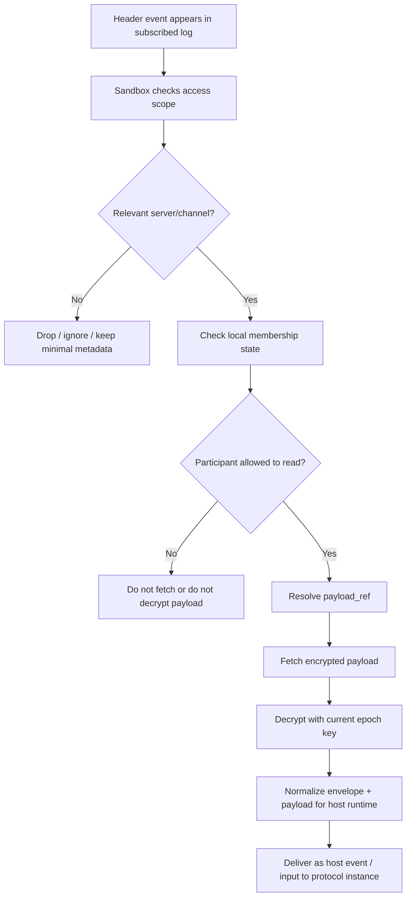

## 10. Agent Write Path

This diagram presents the write-side path by which a protocol instance produces an outgoing message. Its purpose is to show how runtime output becomes a stored payload and a published header event. The central terms are **protocol output**, **payload construction**, **envelope metadata**, **payload storage**, **signed header**, and **channel publication**. This projection complements the read path and should be understood as the outbound side of the same two-layer message architecture.

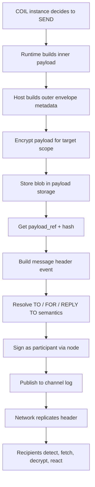

## 11. Governance Event Legitimacy Verification

This diagram describes how a node verifies whether a governance event is valid. Its purpose is to formalize legitimacy checking as a separate process from replication or execution. The key terms are **event type**, **signature verification**, **root-level event**, **delegated event**, **grant scope**, and **non-transitive authority**. This projection belongs to the trust model of the system and is especially important for understanding why not every signed event is automatically considered authoritative.

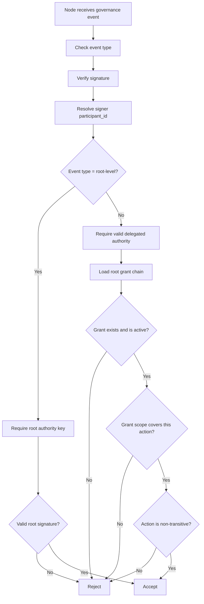

## 12. Whole-System Architecture Map

This diagram provides a synthetic, high-level view of the entire architecture. Its purpose is to situate the three major layers—**root governance**, **Corazon Network**, and **local execution environments**—within one coherent picture. The main terms are **root authority**, **delegated authorities**, **control logs**, **channel logs**, **payload layer**, **application layer**, and **edge sandboxes**. This projection is not intended for protocol detail; rather, it serves as an orientation map for the system as a whole.

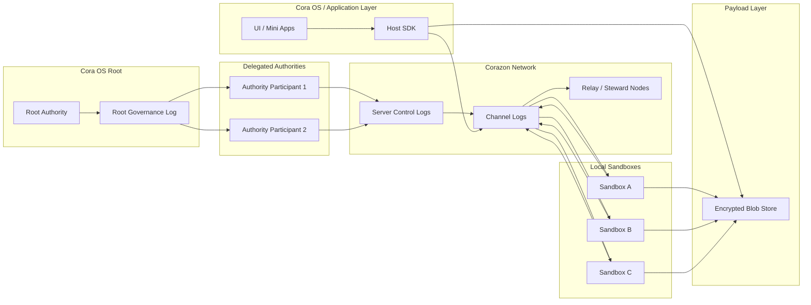

---

Animata Systems, 2026
